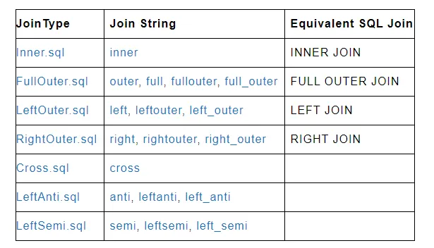

# Spark_Scala_Snippet
Spark and Scala Code snippets

### SourceData
    corruptedRecord.scala

### DataFrame
    JoinsDemo
    1)Inner-Join
    2)Outer-Join
    3)Left-Join
    4)Right-Join
    5)Cross-Join
    6)Left-Anti-Join
    7)Left-Semi-Join

